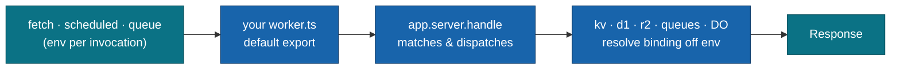

<div align="center">

# @moku-labs/worker

**The Cloudflare Workers backend for Moku — Durable Objects, Queues, R2, D1, and KV, each a composable plugin.**

Every Cloudflare primitive is a Moku plugin that resolves its binding **per request** off the Worker `env` — never stored, never shared across the concurrent requests one isolate serves. A `server` plugin owns HTTP routing and dispatch; build-time `deploy`/`cli` ship the Worker but stay out of the runtime bundle. Not an ORM, not a router framework, not a replacement for Wrangler — the thin, typed seam between your handlers and Cloudflare's runtime, built on [`@moku-labs/core`](https://github.com/moku-labs/core) and designed to compose with [`@moku-labs/web`](https://github.com/moku-labs/web).

<br/>

[](https://www.npmjs.com/package/@moku-labs/worker)
[](https://github.com/moku-labs/worker/actions/workflows/ci.yml)
[](#requirements)
[](#requirements)
[](https://github.com/moku-labs/core)
[](./LICENSE)

<br/>

[Why](#why-moku-labsworker) · [Quick start](#quick-start) · [How it works](#how-it-works) · [Plugins](#plugins) · [Configuration](#configuration) · [Scripts](#scripts)

</div>

---

## Why @moku-labs/worker

- **Every primitive is a plugin.** KV, D1, R2, Queues, and Durable Objects each compose into `createApp` — add only what you use; the rest tree-shakes away.
- **`env` is a call argument, never state.** Bindings are threaded per request and live only on the call stack, so one isolate serving concurrent requests can never leak bindings between them.
- **One bundle, no Node leakage.** The build-time `deploy`/`cli` plugins reach for `node:fs` and `node:child_process`, but `"sideEffects": false` keeps them out of any request-time Worker bundle that doesn't list them.
- **Not an ORM, not a router framework.** Thin, typed wrappers over the real Cloudflare APIs (`prepare().bind()`, `KVNamespace`, `R2Bucket`) — no abstraction to learn on top of the platform.
- **The server half of Moku.** `@moku-labs/web` supplies the request/island layer; this supplies the Cloudflare primitives — same kernel, same plugin model, no second code path to keep in sync.

## Quick start

```sh
bun add @moku-labs/worker
bun add -d @cloudflare/workers-types
```

> [!NOTE]
> **Status: `0.x` — early.** API may shift before `1.0`. Built on `@moku-labs/core` (`1.x`, semver-compliant). `wrangler` is an **optional** peer — needed only when you add the `deploy`/`cli` plugins.

Declare your routes as data, then hand-assemble the Worker entry from `app.server`:

```typescript
// app.ts
import { createApp, endpoint } from "@moku-labs/worker";

export const app = createApp({
  config: { name: "my-api", compatibilityDate: "2026-06-17" },
  pluginConfigs: {
    server: {
      endpoints: [
        endpoint("/health").get(() => new Response("ok")),
        endpoint("/api/data/{lang:?}").get(({ params }) =>
          Response.json({ lang: params.lang ?? "en" })
        ),
        endpoint("/users/{userId}").get(
          ({ params }) => new Response(`user=${params.userId}`)
        )
      ]
    }
  }
});
```

```typescript
// worker.ts — the default export is hand-assembled; no plugin produces it.
import { app } from "./app";

export default {
  fetch: (request: Request, env: Record<string, unknown>, ctx: ExecutionContext) =>
    app.server.handle(request, env, ctx)
} satisfies ExportedHandler;
```

`createApp` is synchronous, built once per isolate at module load, and frozen. `bindings` and `server` are wired in by default — you never list them. A request to `/api/data/fr` returns `{ "lang": "fr" }`; `/api/data` returns `{ "lang": "en" }`; an unmatched path returns `404`. Path params mirror `@moku-labs/web`: `{name}` is required (typed `string`), `{name:?}` is optional (typed `string | undefined`).

## How it works

Three layers, one kernel. `createCoreConfig` declares config + events and registers the core plugins; `createCore` wires the framework defaults; your code calls `createApp`. At runtime, each Cloudflare invocation threads its `env` down through the entry into `app.server` and out to whichever resource plugins a handler reaches:



| Layer | File | Produces |
|---|---|---|
| 1 — config + events | `src/config.ts` | `createCoreConfig` → `WorkerConfig`, `WorkerEvents`; registers core plugins (`log`, `env`) |
| 2 — framework + plugins | `src/index.ts` | `createCore` → `createApp` / `createPlugin`; wires `bindings` + `server` defaults |
| 3 — consumer app | your code | `createApp({ … })` |

## Env is the contract

> The binding lives on the request, not on the plugin.

One Cloudflare isolate serves many concurrent requests, so every binding-resolving method takes the per-request `env` as its **first argument** and reads it on the call stack — `env` is never captured in plugin state:

```typescript
app.kv.get(env, "feature-flags");                // env-first KV read
app.d1.query(env, "SELECT 1");                   // env-first D1 query
app.durableObjects.get(env, "board", "room-42"); // env-first DO stub
```

Inside a `server` handler you receive `env` (plus a cross-plugin `require` and an `has` presence check) on the per-request `RequestContext`, and thread it onward — so two requests in flight at once can never observe each other's bindings:

```typescript
endpoint("/cache/{key}").get(async ({ params, env, require, has }) => {
  if (!has("kv")) return new Response("kv not configured", { status: 501 });
  const value = await require(kvPlugin).get(env, params.key);
  return value === null ? new Response("miss", { status: 404 }) : new Response(value);
});
```

The core plugins are **flat-injected** on every plugin's `ctx` — `ctx.log`, `ctx.env` — and also mounted on the app surface (`app.log`, `app.env`). Deployment stage is plain global config: `ctx.global.stage`.

## Plugins

Name **strings** are bare (`"server"`, `"kv"`); the exported **instances** carry the `Plugin` suffix (`serverPlugin`, `kvPlugin`). Everything ships from the `@moku-labs/worker` root.

| Plugin | Tier | Responsibility | Key API |
|---|---|---|---|
| [`bindings`](src/plugins/bindings/README.md) | Standard | Resolves Cloudflare bindings off the per-request `env`; the binding-family dependency root. | `require(env, name)`, `has(env, name)` |
| [`server`](src/plugins/server/README.md) | Standard | HTTP routing + request/scheduled dispatch; the Worker-entry surface. | `handle`, `scheduled`, `endpoint` |
| [`kv`](src/plugins/kv/README.md) | Micro | Thin env-first wrapper over one KV namespace. | `get`, `put`, `delete`, `list` |
| [`d1`](src/plugins/d1/README.md) | Standard | Typed wrappers over D1's `prepare().bind()`. Not an ORM. | `query`, `first`, `run`, `batch`, `prepare` |
| [`queues`](src/plugins/queues/README.md) | Standard | Cloudflare Queues producer + consumer. | `send`, `sendBatch`, `consume` |
| [`storage`](src/plugins/storage/README.md) | Complex | R2 object storage behind a provider-adapter seam. | `get`, `put`, `delete`, `list` |
| [`durableObjects`](src/plugins/durable-objects/README.md) | Standard | Resolves DO stubs off `env`; ships `defineDurableObject`. | `get`, `defineDurableObject` |
| [`deploy`](src/plugins/deploy/README.md) | Complex | Build-time orchestrator: detect → provision → wrangler-config → upload → deploy. **Node-only.** | `run`, `dev`, `init` |
| [`cli`](src/plugins/cli/README.md) | Standard | Developer-facing `dev` / `deploy` verbs + live progress TUI. **Node-only.** | `dev`, `deploy` |

> The `log` and `env` core plugins are **not authored here** — they come from [`@moku-labs/common`](https://github.com/moku-labs/common) and are re-exported (`logPlugin`, `envPlugin`). `env` is environment-**variable** access; deployment stage is plain global config (`config.stage`, read via `ctx.global.stage`). Helpers `endpoint(path)` and `defineDurableObject(name)` ship from the root too.

Add a resource plugin by appending it — defaults stay implicit:

```typescript
import { createApp, kvPlugin } from "@moku-labs/worker";

const app = createApp({
  plugins: [kvPlugin], // append only what you add
  pluginConfigs: {
    bindings: { required: ["MY_KV"] }, // fail fast if the binding is missing
    kv: { binding: "MY_KV" }
  }
});
```

> [!IMPORTANT]
> The final plugin list is `[…frameworkDefaults, …yourPlugins]`. Defaults are `[log, env, bindings, server]`, registered first; your `plugins` append after. **Do not re-list a default** — re-listing collides on name and throws `TypeError: [worker] Duplicate plugin name: "bindings"` at init. `pluginConfigs` is keyed by name, so you can still configure a default (e.g. `bindings.required`) without listing it.

## Runtime vs. node-only

Deploy tooling is built from the same plugin model but kept strictly out of the request-time bundle.

| Surface | Entry | In the Worker bundle? | Carries |
|---|---|---|---|
| Runtime | `@moku-labs/worker` (`.`) | Always | `createApp`, `createPlugin`, all resource plugins, `server`, helpers, types |
| Node-only | `@moku-labs/worker` → `deployPlugin` / `cliPlugin` | Only if you add them | `deploy` + `cli`; pulls in `node:fs` / `node:child_process` |

> [!TIP]
> Everything ships from the root entry — including `deployPlugin`/`cliPlugin`. Because the package is `"sideEffects": false`, a Worker that imports `createApp` and never lists those two tree-shakes the Node built-ins away, with no separate entry point. The `./cli` subpath remains as a back-compat alias.

## Configuration

The global `WorkerConfig`, passed as `createApp({ config })` — flat, with complete defaults:

| Field | Type | Default | Notes |
|---|---|---|---|
| `name` | `string` | `"worker"` | Worker name; `deploy` uses it as the wrangler `name`. |
| `stage` | `"production" \| "development" \| "test"` | `"production"` | Production-safe default. Read via `ctx.global.stage`; `deploy`/`cli` use it to suffix resource names (`production` = bare). |
| `compatibilityDate` | `string` | `""` | Cloudflare compatibility date; `deploy` uses it as `compatibility_date`. |

Per-plugin config goes under `pluginConfigs.<name>` (e.g. `server.endpoints`, `kv.binding`, `bindings.required`, `deploy.configFile`). Every config is flat with complete defaults — overriding one key never drops siblings — and **frozen** after `createApp`. Each field is documented in that plugin's README, linked in the [Plugins](#plugins) table.

## Events

Events are fire-and-forget observability — request/response and deploy **work** flows through API return values, never through `emit`. Global events live on `WorkerEvents` (`src/config.ts`) and are visible to every plugin; plugin-local events are reached via `depends: [<plugin>]`.

| Event(s) | Emitted by | When |
|---|---|---|
| `request:start` · `request:end` | `server` | Around each `handle` — start (fresh `requestId`), end (final `status` + `ms`). |
| `server:matched` *(local)* | `server` | After a request matches an endpoint, before the handler runs. Not on `404`. |
| `queue:message` *(local)* | `queues` | After `config.onMessage` settles for a message inside `consume`. |
| `deploy:phase` · `deploy:complete` | `deploy` | Each pipeline stage; final deployed `url`. |
| `provision:plan` · `provision:resource` · `provision:skip` | `deploy` | Provisioning plan, then per-resource create or skip. |
| `auth:verified` | `deploy` | After Cloudflare auth resolves (`account`, `accountId`, `scopes`). |
| `dev:phase` · `dev:rebuilt` · `dev:error` | `deploy` | Local `dev` server: stage, incremental rebuild (`files` + `ms`), error. |

```typescript
// A plugin's `hooks` factory receives `ctx` and returns an event → handler map.
hooks: (ctx) => ({
  "deploy:phase": ({ phase, detail }) => ctx.log.info(`▸ ${phase}${detail ? ` (${detail})` : ""}`),
  "deploy:complete": ({ url }) => ctx.log.info(`✓ ${url}`)
})
```

## Scripts

Run with **bun** — never npm/yarn/pnpm.

```sh
bun run build              # build with tsdown → dist/
bun run test               # all tests (vitest)
bun run test:unit          # unit tests only
bun run test:integration   # integration tests only
bun run test:coverage      # tests with coverage (90% threshold)
bun run typecheck          # tsc --noEmit
bun run lint               # biome check + eslint
bun run lint:fix           # auto-fix lint issues
bun run format             # biome format --write
bun run validate           # publint + are-the-types-wrong
```

## Requirements

- **Node `>= 24`** and **Bun `>= 1.3.14`** — use `bun` exclusively (never npm/yarn/pnpm).
- **TypeScript** in strict mode, with `exactOptionalPropertyTypes` and `noUncheckedIndexedAccess`.
- **[`@moku-labs/core`](https://github.com/moku-labs/core)** — the micro-kernel this framework is built on (installed transitively, with `@moku-labs/common`).
- **`@cloudflare/workers-types`** *(dev)* — ambient runtime types (`KVNamespace`, `D1Database`, `R2Bucket`, `ExecutionContext`, …); add to your tsconfig `types`. Type-only, never bundled.
- **`wrangler`** *(optional peer)* — required only when you add `deployPlugin`/`cliPlugin`. Invoked as a subprocess; never bundled.

## Docs

- **Per-plugin READMEs** — authoritative API, config, and events for each plugin, linked in the [Plugins](#plugins) table.
- **[Moku Core specification](https://github.com/moku-labs/core/tree/main/specification)** — the underlying kernel model: `createCoreConfig`, `createCore`, `createApp`, lifecycle, events.

## License

[MIT](./LICENSE) © [moku-labs](https://github.com/moku-labs)
